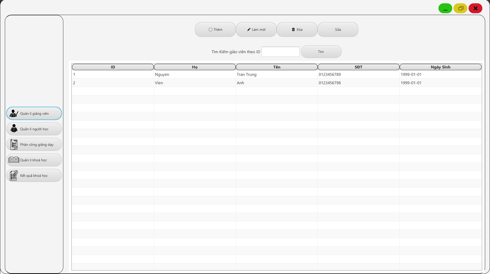
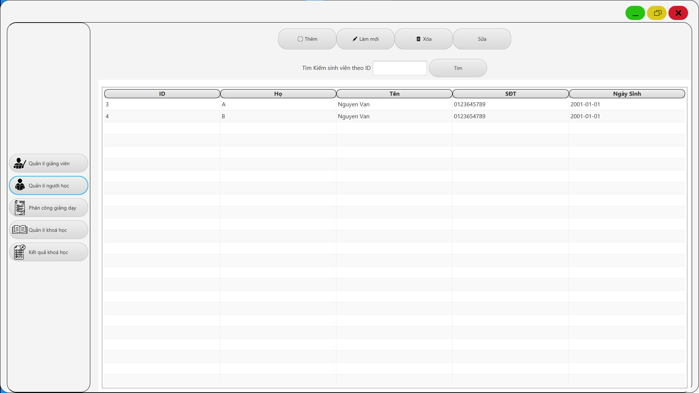
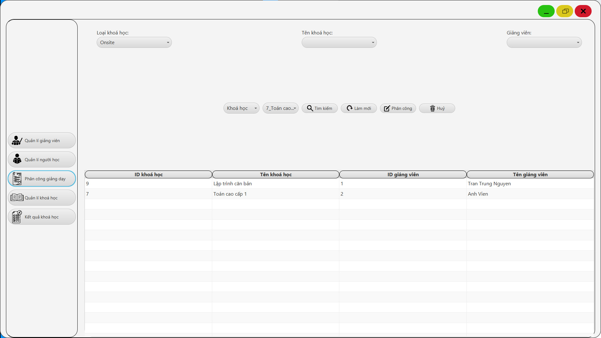
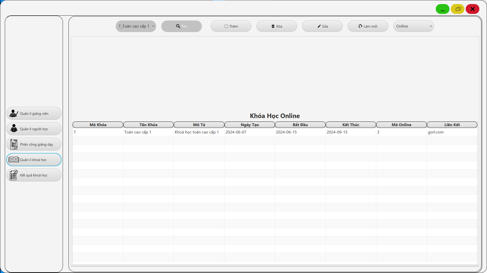
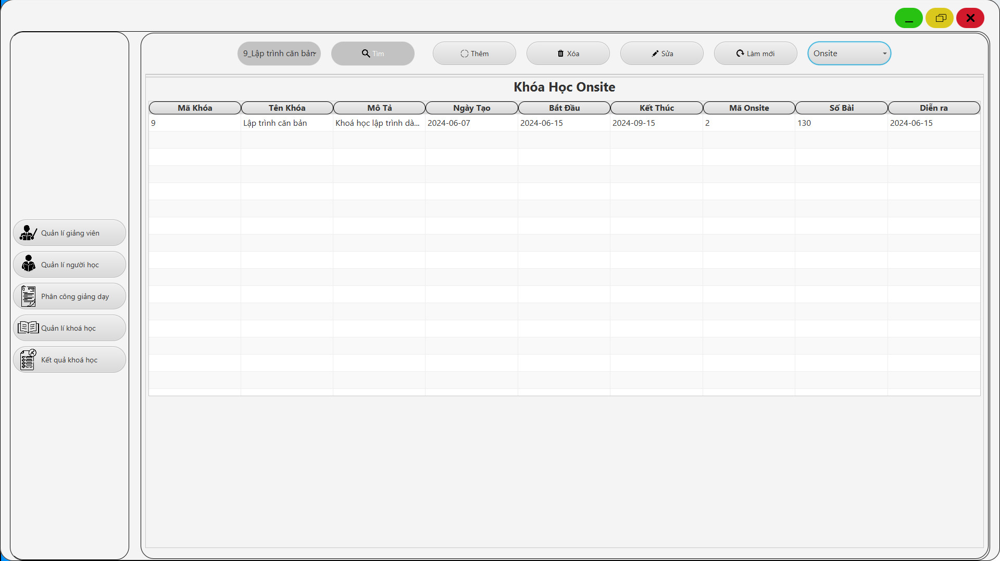
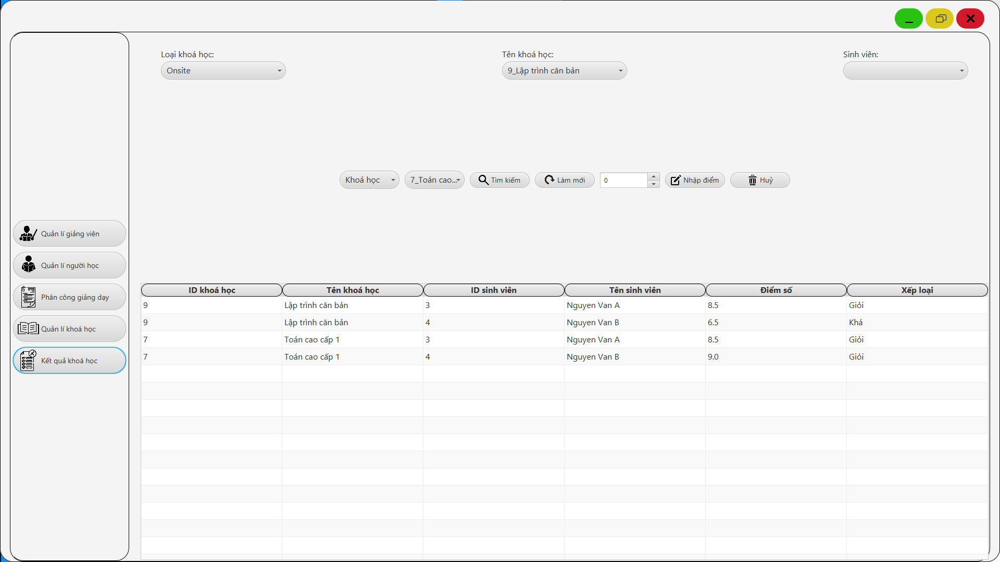

> [!IMPORTANT]
> THIS IS JUST A PROJECT FOR STUDYING PURPOSE

# Course Manangement
### Description
  - Project for manage students, teachers, courses, assignment and score
  - This project build by JavaFx with 3-layers model
### Technology
  - Language: Java, JavaFx
  - Database: MSSQL Server
### UI
  - Teacher Management
  
  - Student Management
  
  - Assigment Management
  
  - Course Management
  
  
  - Score Management
  
### HOW TO RUN
  - Clone this project from github: ```git clone https://github.com/minhthuan26/Course-Management.git```
  - Open project with Intellij IDE
  - Add VM option: ```--module-path "<Path to javafx-sdk-19/lib>" --add-modules javafx.controls,javafx.fxml```
  - Install MSSQL Server from [MSSQL Server](https://www.microsoft.com/en-us/sql-server/sql-server-downloads)
  - Create SQL Server Database name **CourseManagement** by run this file script ```SQLQuery1.sql```
  - Change connection info in **src/QuanLiKhoaHoc/DAL/ConnectDB.java** if need
  - Run **src/QuanLiKhoaHoc/GUI/Main/MainStartApp** class to start


